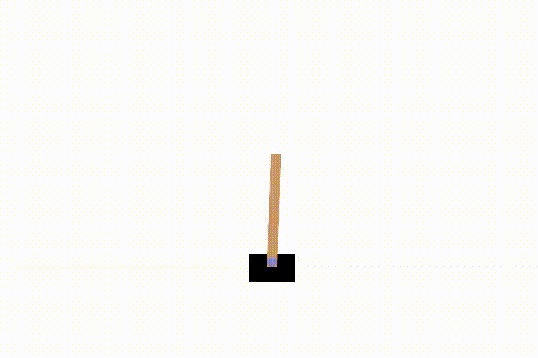
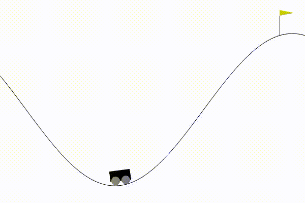
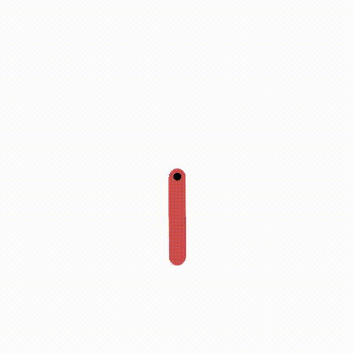
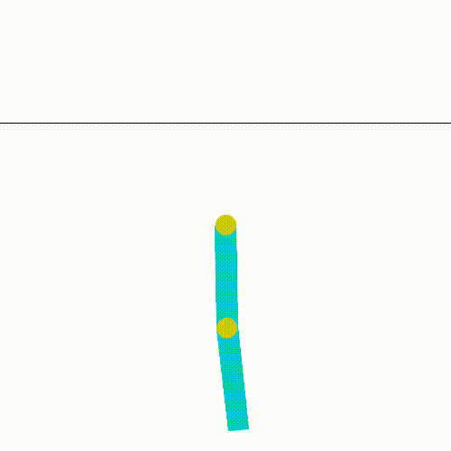
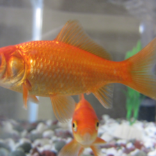
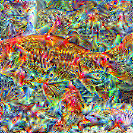

# OpenAI gymnasium agents punished til obedient
[!TIP]
All stick and no carrot make robots good boys

# Algorithms
## Deep Q Learning
    - cart_pole - Discrete action space, left and right
    - car_racing - Discrete action space, only controlling turn angle between [-1.0 -0.5 0.0 0.5 1.0]
## Actor-Critic Policy Gradient
    - mountain_car - Discrete action space, [accelerate forward, accelerate backward, do nothing]
    - mountain_car_continous - Continuous aciton space, -1.0 -> 1.0 acceleration
    - pendulum - Continous action space, -2.0 -> 2.0 applied torque at joint
    - acrobot - Discrete action space, [-1, 0, 1] torque applied to middle joint
## Proximal Policy Optimization
    - car_racing_continous - Continous action space, -1.0 -> 1.0 turn angle, -1.0 -> 1.0 gas/breaking

## Classic Control

### cart_pole
Pretty successful cart pole balancing network using (deep?) Q-learning that managed to produced a scared little cart thats been punished too much for falling over

### continous action space mountain car
Faster you get up that hill less I can punish you lil car

### Continous action space pendulum
Any angle > 90 deg put this pendulum in excruciating pain, he got out of there fast

### Acroboat, discrete action space
acrobat robot swingy swung all the way up

## Box2D

### car racing
This car has been severely tortured into submission. With deep Q learning, binning the action space

# Other

## Confusion

### simple_attack
Makes small changes to image to change classification

### Main
Deep dream, kinda, 

