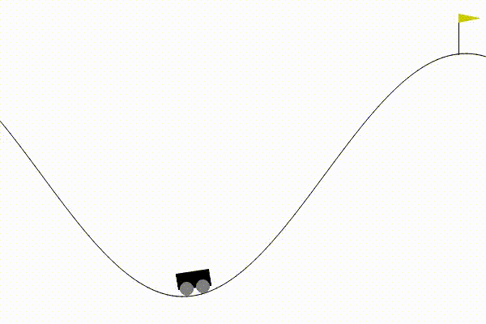
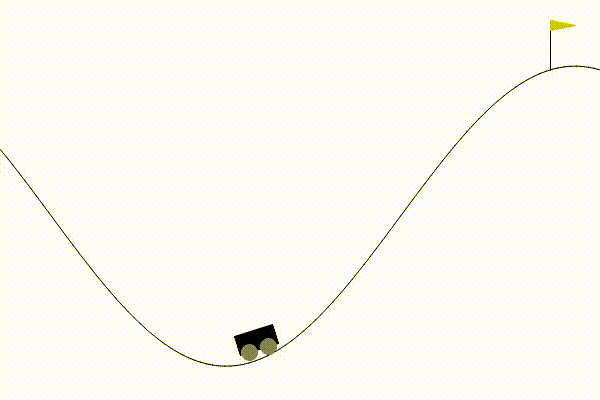

# OpenAI gymnasium agents punished til obedient
## All stick and no carrot

### cart_pole
Pretty successful cart pole balancing network using (deep?) Q-learning that managed to produced a scared little cart thats been punished too much for falling over

### car racing
This car has been severely tortured into submission. With deep Q learning, binning the action space

### discrete action space mountain car
this dumb little mountain car only capable of 3 actions got his ass whooped until his policy was good enough.
Actor-critic policy gradient

### continous action space mountain car
This stupid little car got rewards for getting closer to the flag but not enough when taking it so he started teasing me.

His smarter brother got a big reward for getting the flag

### Cont action space penduul
Good boy pendulum
