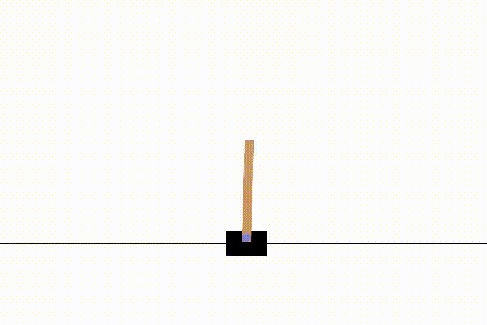

### OpenAI gymnasium implementations

# cart_pole
Pretty successful cart pole balancing network using (deep?) Q-learning
produced a scared little cart thats been punished too much for falling over

